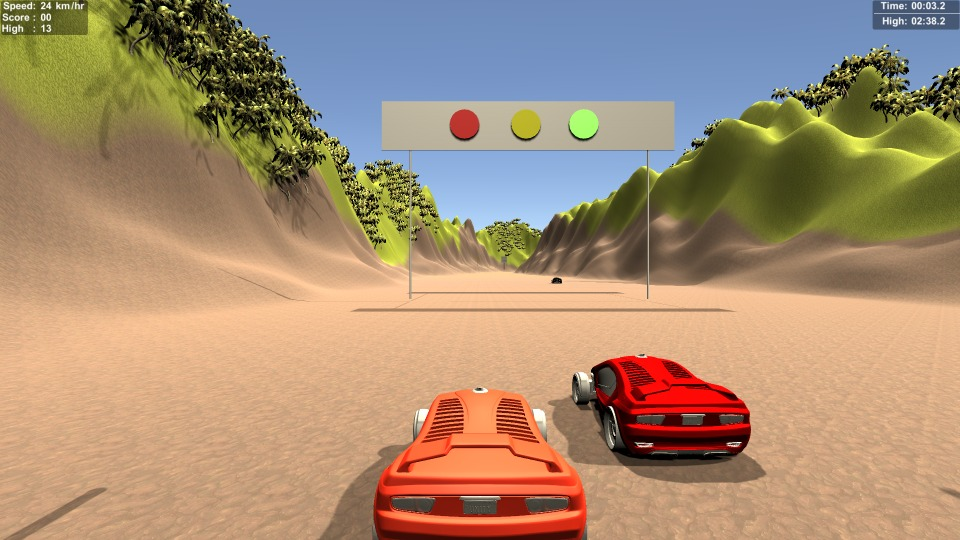
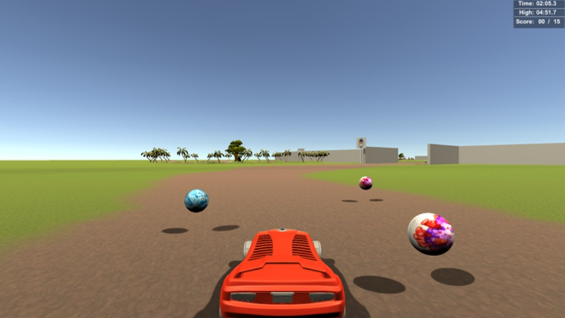

# LIF(Learning Is Fun) - basic learning and awareness game

## Description of the game:
- The Theme of the game is to make users aware of some basic knowledge on traffic rules safety measures during covid pandemic with making the users attentive throughout the game .
- The game consists of two levels. The first one is a car simulator where the player will be driving a car on an infinite road which consists of some checkpoints. Each checkpoint corresponds to a different task. At each checkpoint the player shall be following the rules that are on the signboard on the side of the road, traffic signal etc .if the player fail to follow the rules, then he shall be deducted points and after some limit the game gets over and he has to restart the level.
- In the second level , the player shall run on the track and reach the vaccination centre. On the way there shall be some virus capsules and sanitizer capsules.if the player takes the virus capsules then the player shall die and the game restarts. If the player has some sanitizer capsules and he takes the virus capsules then the player will not be affected and the score will be displayed on the screen. The player shall be required to answer some questions based on road safety and precautions during covid in order to move to the next level.

## How to play the game:
- In the first level the car shall be controlled by the arrow keys and spacebar for applying the brakes .
- The player shall not cross the traffic signal if the colour is red (if he does cross then score will be deducted) and shall wait till the colour turns green.
- The player shall observe the speed sign boards on the road and shall reduce the speed of the car in order to avoid penalty.
- The player shall search for a suitable vacant spot and park his vehicle
- Press button c for changing your camera view
- In the second level the player shall run on the track by arrow keys and stay away from the virus capsules and collect sanitizer capsules for increasing the health and reach the vaccination centre.

## Screenshots

## Technologies:
- Unity3D
- C#

## Platform specifications:
- Computer systems which support web browsers.

## Drawbacks:
- in both levels we have not put the boundaries so user can drive his car anywhere. he can also go out of the provided space.
- in second level we should have used a person bot instead of car.

## Game demo:
- Find the [demo](https://drive.google.com/file/d/10WDub6GJqr9ZrAyq2ACuhu46pplLFLDy/view) for more details

## How to play:
- play [online](https://play.unity.com/mg/other/new-unity-game-1) hosted on unity.
- run the .exe file present in LIF BUILD folder.
